# Object Flaw Detector

| Details            |                 |
|-----------------------|------------------|
| Target OS:            |  Ubuntu\* 16.04 LTS     |
| Programming Language  |  C++ |
| Time to complete:     |  30 min      |


## Introduction

This object flaw detector application detects the anomalies present in the objects moving on a conveyor belt. The application identifies the number of objects moving on the conveyor belt and checks for the presence of defects in the color and orientation of the object. The objects are checked for the presence of cracks. The ones containing cracks are marked as defective.

## Requirements

* Ubuntu 16.04
* Intel® Distribution of OpenVINO™ toolkit
* Intel® System Studio 2018 

## How it works

* This application takes the input from a video camera or a video file for processing.

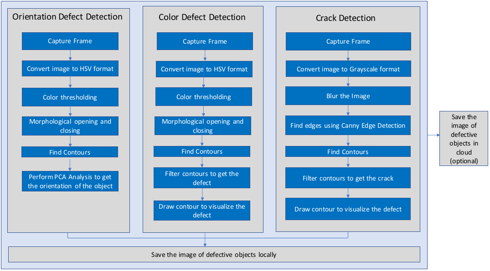

* Orientation defect detection: Get the frame and change the color space to HSV format. Threshold the image based on the color of the object using [inRange](https://docs.opencv.org/3.4.0/da/d97/tutorial_threshold_inRange.html) function to create a mask. Perform morphological opening and closing on the mask and find the contours using [findContours](https://docs.opencv.org/3.4.0/d4/d73/tutorial_py_contours_begin.html) function. Filter the contours based on the area. Perform [PCA](https://docs.opencv.org/3.4/d1/dee/tutorial_introduction_to_pca.html) on the contours to get the orientation of the object.

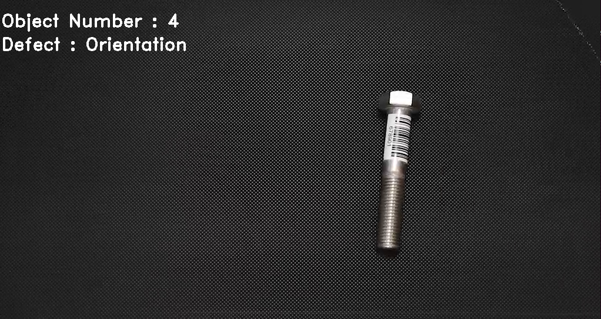

* Color anomaly detection: Threshold the image based on the defective color of the object using [inRange](https://docs.opencv.org/3.4.0/da/d97/tutorial_threshold_inRange.html) function. Use the mask obtained from the [inRange](https://docs.opencv.org/3.4.0/da/d97/tutorial_threshold_inRange.html) function to find the defective area.

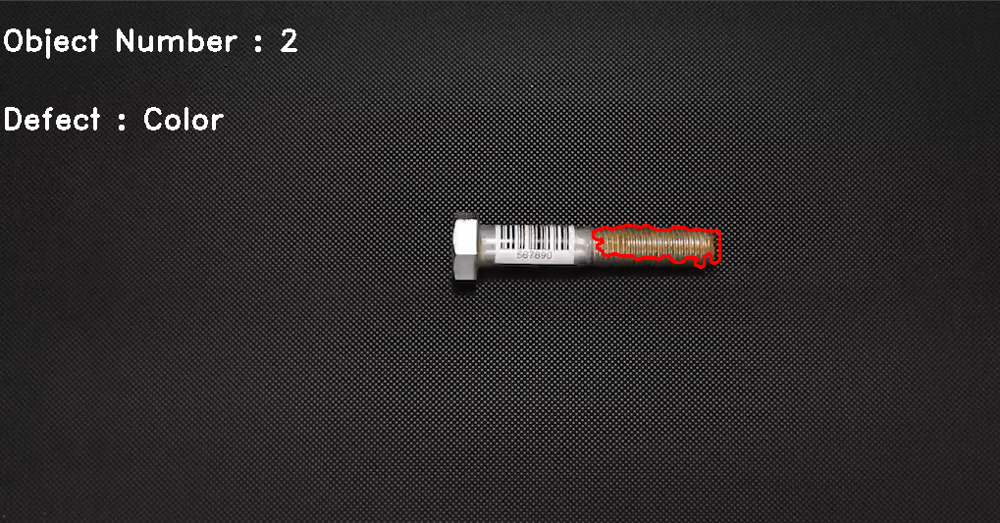

* Crack detection: Transform the image from BGR to Grayscale format using [cvtColor](https://docs.opencv.org/3.4.3/d7/d1b/group__imgproc__misc.html#ga397ae87e1288a81d2363b61574eb8cab) function. Blur the image using [blur](https://docs.opencv.org/3.4.0/dc/dd3/tutorial_gausian_median_blur_bilateral_filter.html) function to remove the noises. Use the contours found on the blurred image to detect the cracks.

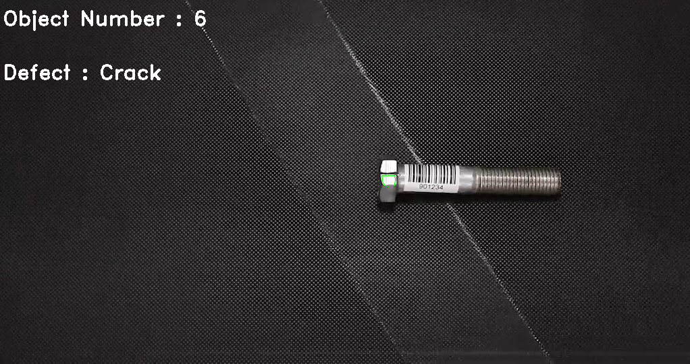

* Save the images of defective objects in their respective folders. For example, objects with color defect are saved in **color** folder, objects containing cracks are saved in **crack** folder and objects with no defect are stored in **no_defect** folder.

## Setting the build environment

On the system, open Intel® System Studio 2018 and choose your workspace.
1. Click **File -&gt; New -&gt; Project -&gt; Application Development**.
2. Select **C/C++ project to build and run on this Linux Operating System**.

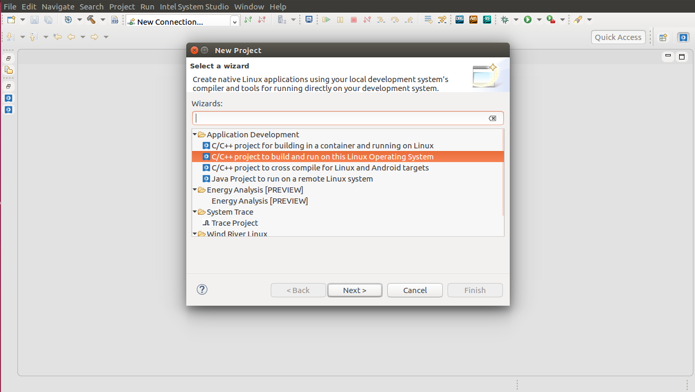

3. Select **Intel Complier -&gt; Matrix Multiplication -ICC** example and change the name of the project to **object_flaw_detector**. 

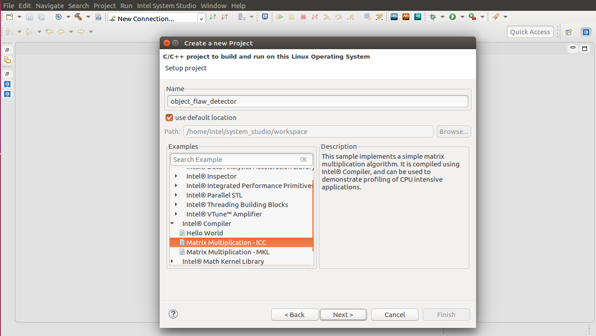

4. Click **Next**. Select Complier for the project as **GNU Compiler Collection (GCC)**. Click **Finish**.

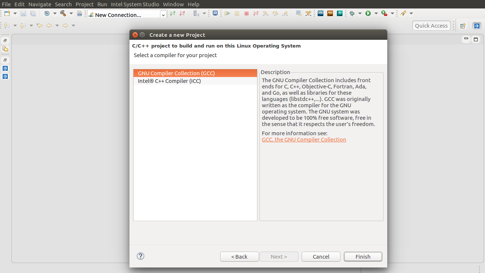

5. Delete the file named **compiler_sample.cpp**(example code) from the Project Explorer.
6. Click **File -&gt; New -&gt; File**. Select the parent folder and name the new file as **product-flaw-detector.cpp**.
7. Copy the code from **product-flaw-detector.cpp** of this repository to the newly created file.


### Add Include Path
1. Select **Project -> Properties -> C/C++ General -> Paths and Symbols**
2. Select **Includes -> GNU C++** and Click on **Add...**
3. Add *opt/intel/computer\_vision\_sdk\_&lt;version&gt;/opencv/include* to include the path of the Intel® Distribution of OpenVINO™ toolkit.

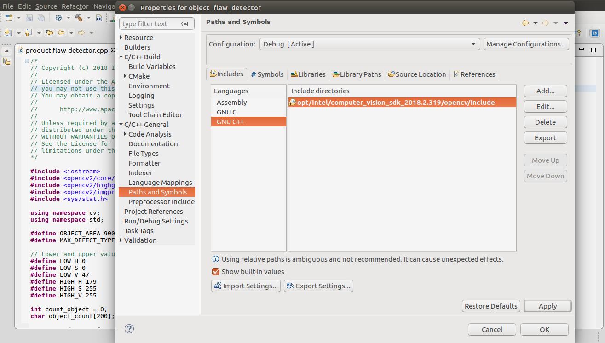


### Add Libraries  
1. Select **Project -&gt; Properties -&gt; C/C++ Build -&gt; Settings -&gt; C++ Linker -&gt; Libraries**
2. Add *opt/intel/computer\_vision\_sdk\_&lt;version&gt;/opencv/lib* to ```Library Search Path (-L)```
3. Add **opencv_core, opencv_highgui, opencv_imgproc, opencv_imgcodecs, opencv_videoio** to the ```Libraries (-l)```

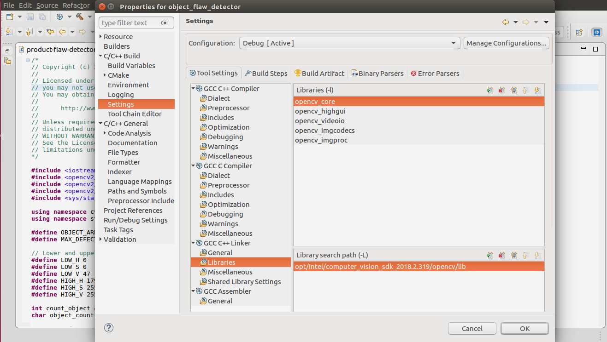

Select **Project -&gt; Properties -&gt; C/C++ Build -&gt; Settings -&gt; GCC C++ Compiler -&gt; Dialect**.
Select the Language standard as ISO **C++ 11(-std=c++0x)** and click **OK**.

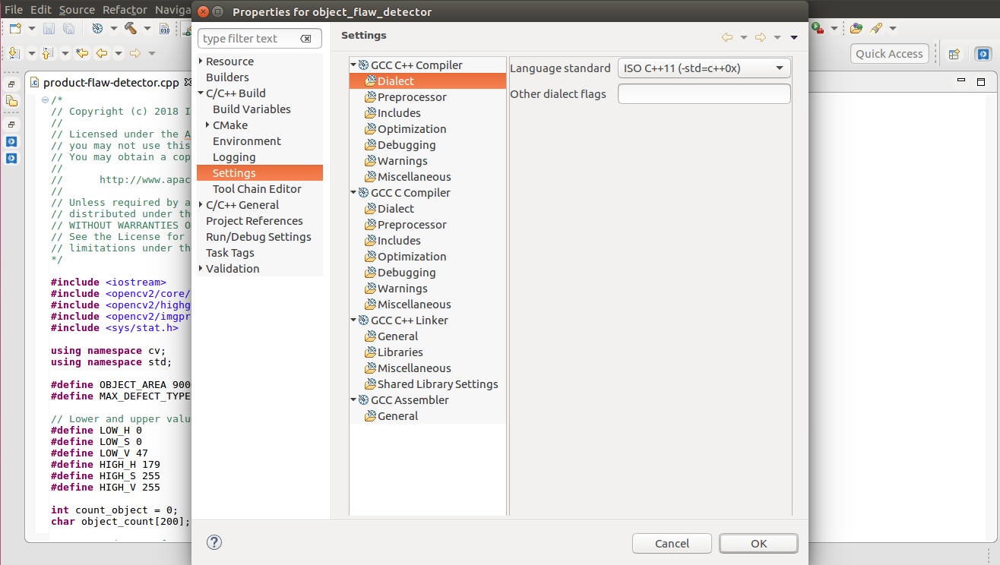


### Build the project 
1. Select **Project -&gt; Build Project** and click **OK**.

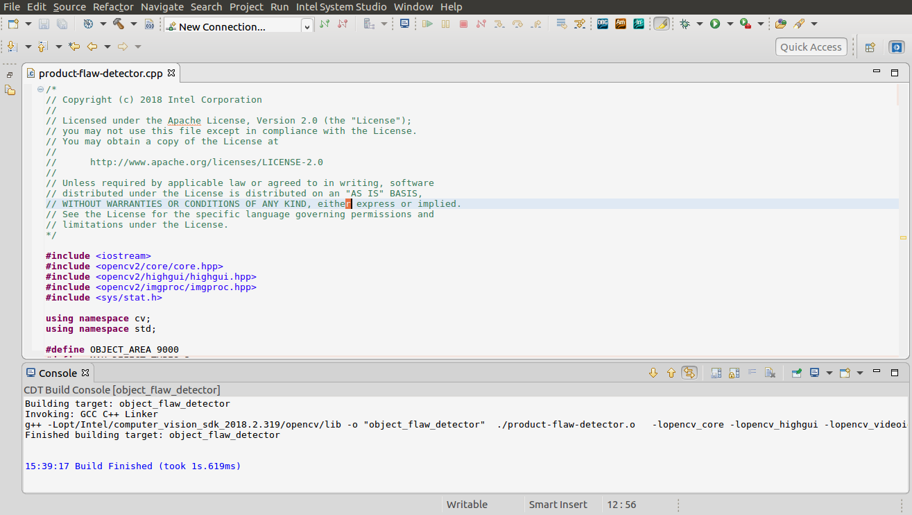

### Run the project
1. Select **Run -&gt; Run Configuration.. -&gt; C/C++ Application -&gt;**. Choose the project **object_flaw_detector**.
2. Click on **Arguments** and specify the path of the video under **Program Arguments**.
3. Click **Run**.

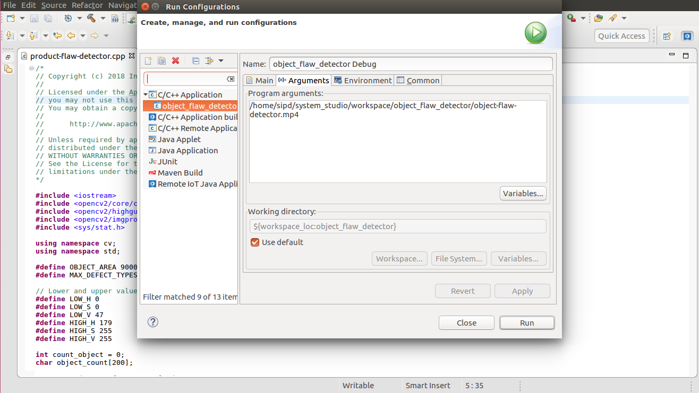

## To run the application from the terminal

* Open a terminal on Ubuntu.

* Updates to several environment variables are required to compile and run Intel® Distribution of OpenVINO™ toolkit applications. Run the following script on the terminal to temporarily set the environment variables.
 
   ``` source /opt/intel/computer_vision_sdk_2018.2.<version>/computer_vision_sdk/bin/setupvars.sh ```

*  Go to object flaw detector directory.
	
   ``` cd <path-to-object-flaw-detector> ```

* Create a directory **build**.

   ``` mkdir build ```

* Build the project.
	
   ``` 
   cd build 	
   cmake .. 
   make 
   ```

* Run the application.

   ``` ./product-flaw-detector <VideoFile> ```

  **Note:** To get the input video from the camera, use the following command:
   ``` ./product-flaw-detector cam ```

